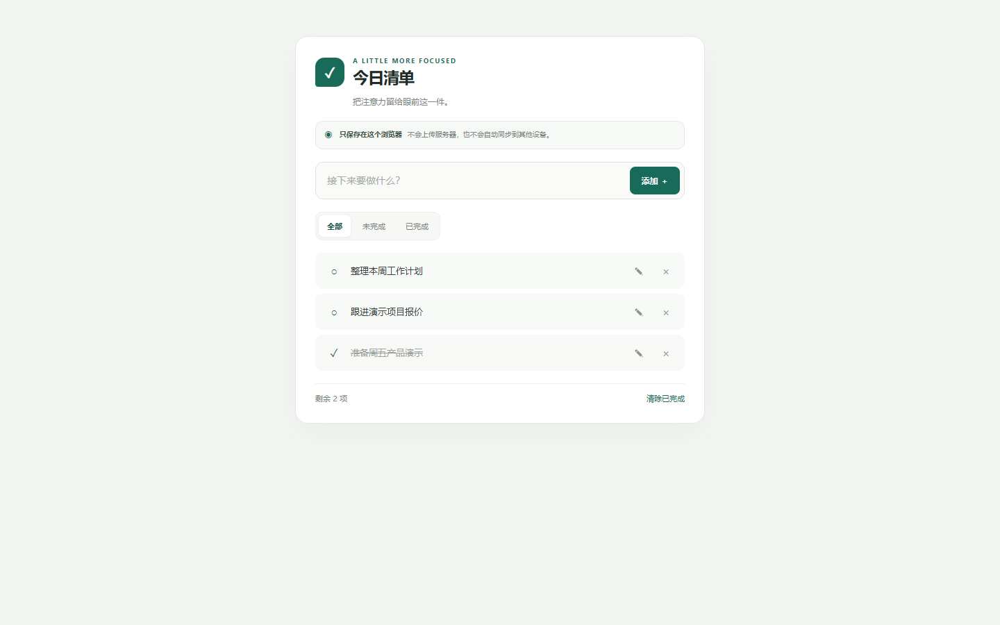

# 今日清单｜轻量中文待办

> **在线体验：**[打开清单](https://starter-todo-app.vercel.app/) · [备用体验地址](https://heart727.github.io/starter-todo-app/)

无需注册或安装，打开网页即可添加、编辑、完成和筛选待办。刷新后任务仍保存在当前浏览器，数据不会上传服务器，也不会自动同步到其他设备。

## 开始使用

1. 打开上方的在线体验地址。
2. 输入一件要做的事，点击“添加”或按回车。
3. 用筛选查看未完成或已完成事项；刷新页面，任务仍会保留在当前浏览器。

> **数据说明：**待办只保存在当前浏览器。清除浏览器站点数据或更换设备后，任务不会自动恢复或同步；遇到无法识别的旧数据时，页面会先保留原内容，等待你确认后再重置。

## 页面示例



## 功能

- ✅ 添加待办事项（按钮或回车键）
- ✅ 标记完成 / 取消完成
- ✅ 删除事项
- ✅ 筛选：全部 / 未完成 / 已完成
- ✅ 显示剩余未完成数量
- ✅ 刷新页面数据不丢失（localStorage）
- ✅ 键盘和屏幕阅读器可识别主要操作
- ✅ 中文界面，手机上也能用

## 项目结构

```
starter-todo-app/
├── index.html    # 页面结构
├── style.css     # 样式（含手机适配）
├── app.js        # 全部功能逻辑
└── README.md     # 本文件
```

## 如何本地运行

最简单的方式：

1. 双击 `index.html`，浏览器里直接打开就能用

或者用命令行：

```bash
# Windows
start index.html

# Mac
open index.html
```

无需安装任何东西，不需要后端，不需要 Node.js。

## 如何部署到免费平台

### 方式一：Vercel（推荐，最简单）

1. 把项目文件夹上传到 GitHub 仓库
2. 打开 [vercel.com](https://vercel.com)，用 GitHub 账号登录
3. 点「New Project」→ 选择你的仓库 → 点「Deploy」
4. 等 30 秒，拿到公开链接 ✅

> 因为本项目是纯静态文件（HTML + CSS + JS），Vercel 无需任何配置即可部署。

### 方式二：Netlify

1. 把项目文件夹上传到 GitHub 仓库
2. 打开 [netlify.com](https://netlify.com)，用 GitHub 账号登录
3. 点「Add new site」→「Import an existing project」→ 选择仓库
4. 点「Deploy site」，拿到公开链接 ✅

### 方式三：拖拽上传（零门槛）

1. 打开 [tiiny.host](https://tiiny.host)（免费托管静态文件）
2. 把 `index.html`、`style.css`、`app.js` 三个文件拖进去
3. 起个名字，点上传，拿到公开链接 ✅

## 适合谁用

适合想用一个简单页面整理个人任务的人。没有账号体系和云端同步，清除浏览器站点数据后，已保存的待办也会被清除；重要事项请另行备份。
